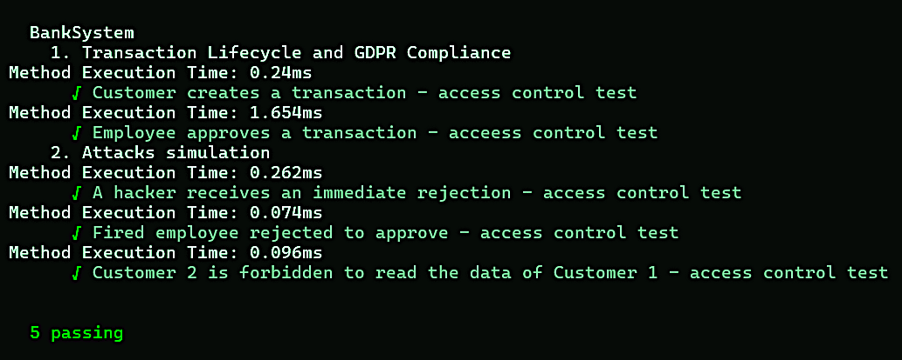

# Implementation and testing of Hybrid Role and Attribute Access Control in a Bank System


## Project Overview

There are four roles: Administrator, Manager, Employee and Customer
- Administrator sets access privileges and deploys the system
- Manager sees all transactions
- Customer creates transaction and sees own transactions
- Employee approves transaction and sees approved by him/ her transactions

## Usage

### Running Tests

To run all the tests in the project, execute the following command:

```shell
npx hardhat test
```

# Unit tests pass successfully.


